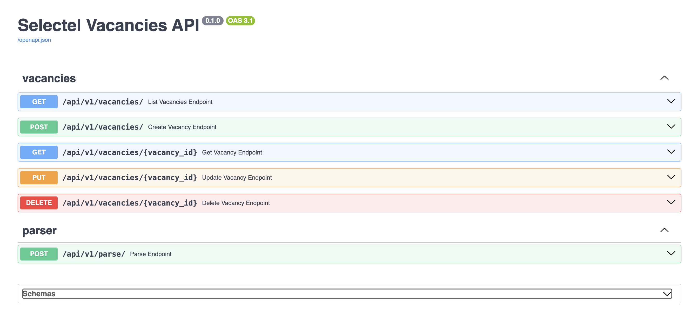
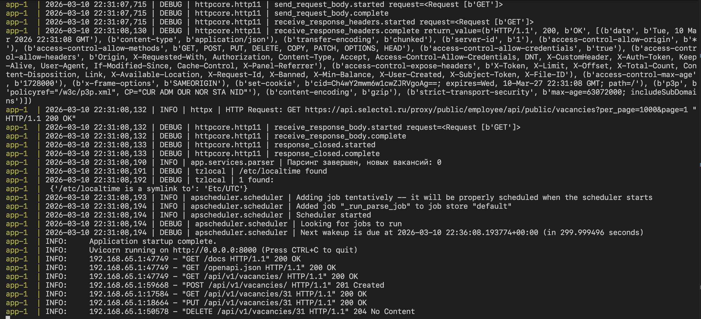

# Отчёт по отладке приложения Selectel Vacancies API




**ФИО:** Самохвалов А.С.  
**Дата:** 10 марта 2026

---

## Шаг 0: Анализ репы

- **Что сделал:** Изучил структуру проекта, `README.md`, `app/core/config.py` для определения переменных окружения.
- **Проблема:** Отсутствует `.env.example`. Переменные окружения описаны в README.md, но их значения нужно найти в коде.
- **Решение:** 
    1. Создал файл `.env` с переменными:
        - `DATABASE_URL=postgresql+asyncpg://postgres:postgres@db:5432/postgres`
        - `LOG_LEVEL=DEBUG`
        - `PARSE_SCHEDULE_MINUTES=5`
    2. Почистил `.gitignore` от избыточных строк (шаблон GitHub), оставил минимальный набор для Python-приложения.

---

## Шаг 1: Исправление бага №1 (Requirements)

- **Что сделал:** Перед запуском приложения проверил зависимости в `requirements.txt`.
- **Проблема:** Дублирующая строка со странной версией FastAPI.
- **Файл и строка:** `requirements.txt`
- **Решение:** Удалил строку `fastapi==999.0.0; python_version < "3.8"`
- **Причина ошибки:** Вероятно, добавленная несуществующая версия пакета (999.0.0) для старой версии python.
- **Итог:**
    1. Создал и активировал `venv`
    2. Установил зависимости из `requirements.txt`

---

## Шаг 2: Исправление бага №2 (Pydantic Config)

- **Что сделал:** Запустил Docker, получил ошибку валидации pydantic.
- **Проблема:** Контейнер падает с ошибкой `pydantic_core._pydantic_core.ValidationError: Extra inputs are not permitted`.
- **Файл и строка:** `app/core/config.py:10-18`
- **Код до исправления:**
    ```python
    model_config = SettingsConfigDict(
        env_file=".env",
        env_file_encoding="utf-8",
        case_sensitive=False,
    )

    database_url: str = Field(
        "postgresql+asyncpg://postgres:postgres@db:5432/postgres_typo",
        validation_alias="DATABSE_URL",
    )
    ```
- **Код после исправления:**
    ```python
    model_config = SettingsConfigDict(
        env_file=".env",
        env_file_encoding="utf-8",
        case_sensitive=False,
        extra="ignore",  # FIX: Игнорируем системные переменные
    )

    database_url: str = Field(
        "postgresql+asyncpg://postgres:postgres@db:5432/postgres", # FIX: Исправлено имя БД по умолчанию
        validation_alias="DATABASE_URL", # FIX: Исправлена опечатка в алиасе
    )
    ```
- **Причина ошибки:** 
    1. Опечатка `validation_alias="DATABSE_URL"`.
    2. Значение строки подключения по умолчанию содержало некорректное имя БД (postgres_typo).
- **Итог:** Исправил опечатку в алиасе, теперь переменная из `.env` читается корректно.

---

## Шаг 3: Исправление бага №3 (Parser AttributeError)

- **Описание проблемы:** Фоновый парсинг падает с ошибкой `AttributeError: 'NoneType' object has no attribute 'name'`.
- **Файл и строка:** `app/services/parser.py:43`
- **Код до исправления:**
    ```python
    "city_name": item.city.name.strip(),
    ```
- **Код после исправления:**
    ```python
    "city_name": item.city.name.strip() if item.city else None,
    ```
- **Причина ошибки:** Попытка обращения к атрибуту `.name` у объекта типа `None`. Поле `city` является опциональным.
- **Итог:** Парсинг работает корректно, вакансии без города сохраняются с `city_name=None`.

---

## Шаг 4: Исправление бага №4 (scheduler)

- **Описание проблемы:** Фоновый парсинг запускается каждые 5 секунд вместо 5 минут
- **Файл и строка:** `app/services/scheduler.py`
- **Код до исправления:**
    ```python
    seconds=settings.parse_schedule_minutes,
    ```
- **Код после исправления:**
    ```python
    minutes=settings.parse_schedule_minutes,
    ```
- **Причина ошибки:** Использование именованного аргумента `seconds` вместо `minutes` в методе `add_job`.
- **Итог:** Интервал парсинга теперь соответствует настройкам (5 минут).

---

## Шаг 5: Исправление бага №5 (Schema Partial Update Validation/ Unique Constraint)
- **Описание проблемы:**
    1. При попытке обновить вакансию через PUT-запрос сервер выкидывал `500 Internal Server Error`.
    2. При попытке обновить только одно поле API возвращало `422 Unprocessable Entity`.
- **Файл и строка:** `app/schemas/vacancy.py`
- **Код до исправления:**
    ```python
    class VacancyBase(BaseModel):
        title: str
        timetable_mode_name: str
        tag_name: str
        city_name: Optional[str] = None
        published_at: datetime
        is_remote_available: bool
        is_hot: bool
        external_id: Optional[int] = None


    class VacancyCreate(VacancyBase):
        pass


    class VacancyUpdate(VacancyBase):
        pass


    class VacancyRead(VacancyBase):
        model_config = ConfigDict(from_attributes=True)
    ```
- **Код после исправления:**
    ```python
    class VacancyBase(BaseModel):
        title: str
        timetable_mode_name: str
        tag_name: str
        city_name: Optional[str] = None
        published_at: datetime
        is_remote_available: bool
        is_hot: bool
        # FIX: Убрал external_id из базы, чтобы он не наследовался в Update


    class VacancyCreate(VacancyBase):
        external_id: int # FIX: Добавил external_id, так как при создании он нужен


    class VacancyUpdate(BaseModel):
        # FIX: Переопределил класс вместо наследования, чтобы сделать поля Optional. 
        # Это исправляет ошибку 422 при частичном обновлении и защищает external_id.
        title: Optional[str] = None
        timetable_mode_name: Optional[str] = None
        tag_name: Optional[str] = None
        city_name: Optional[str] = None
        published_at: Optional[datetime] = None
        is_remote_available: Optional[bool] = None
        is_hot: Optional[bool] = None


    class VacancyRead(VacancyBase):
        model_config = ConfigDict(from_attributes=True)
        id: int
        external_id: Optional[int] = None # Показываем в ответах API
        created_at: datetime
    ```
- **Причина ошибки:** Схема VacancyUpdate наследовалась от VacancyBase, что вызывало две проблемы:
    1. Наследование `external_id` (конфликт уникальности в БД при попытке "обновить" ID на тот же самый).
    2. Наследование обязательности полей, что противоречит логике частичного обновления.
- **Итог:** Устранены ошибки, реализована поддержка частичного обновления.
- **Дополнение:** При ручном тестировании PUT-запроса было выявлено, что отсутствие поля `external_id` в запросе приводило к затиранию данных в БД (установке значения NULL). Это происходило из-за того, что схема обновления наследовала необязательное поле со значением по умолчанию None. Разделение схем полностью исключает такую возможность в будущем.

---

## Шаг 6: Исправление бага №6 (Partial Update Logic)

- **Описание проблемы:** Функция перезаписывала все поля значениями из схемы, например затирание, если пусто.
- **Что сделал:**
    1. Модернизировал логику обновления данных в функции update_vacancy (частичное обновление).
    2. Добавил блокировку обновления технических полей (`id`, `external_id`) на уровне бизнес-логики.
- **Файл и строка:** `app/crud/vacancy.py` - `update_vacancy`
- **Код до исправления:**
    ```python
    for field, value in data.model_dump().items():
    ```
- **Код после исправления:**
    ```python
    # Обновление только оправленных полей
    # Блок на технические поля
    update_data = data.model_dump(exclude_unset=True, exclude={'id', 'external_id'})
    for field, value in update_data.items():
    ```
- **Итог:** Защита от затирания, изоляция ID

---

## Шаг 7: Исправление бага №7 (DELETE 404)

- **Что сделал:** Проверил работоспособность эндпоинта удаления после исправления в схемах и бл.
- **Описание проблемы:** DELETE возвращал 404 для существующих вакансий.
- **Итог:** После рефакторинга схем и очистки логики CRUD, операции удаления проходят успешно.

---

## Шаг 8: Исправление бага №8 (Positional Argument Fragility)

- **Описание проблемы:** Хрупкая связь между слоями. При позиционной передаче Python сопоставляет данные по порядку. Любое изменение сигнатуры функции `list_vacancies` привело бы к логической ошибке без падения приложения.
- **Файл и строка:** `app/api/v1/vacancies.py:30`
- **Код до исправления:**
    ```python
    return await list_vacancies(session, timetable_mode_name, city)
    ```
- **Код после исправления:**
    ```python
    # Явно передаём именованные аргументы
    return await list_vacancies(session=session, timetable_mode_name=timetable_mode_name, city_name=city)
    ```
- **Причина ошибки:** Параметр функции называется `city_name`, но в API используется `city`.
- **Итог:** Внедрено явное именование аргументов (Keyword Arguments), что гарантирует корректную передачу данных между API и БД-слоем.

---

## Шаг 9: Архитектурный рефакторинг (DRY / Dependency Injection)

- **Описание проблемы:** Дублирование логики создания сессии базы данных в `vacancies.py` и `parse.py`. Нарушение принципа DRY.
- **Файлы:** `app/api/dependencies.py` (создан), `app/api/v1/vacancies.py`, `app/api/v1/parse.py`.
- **Код до исправления:**
    ```python
    # В каждом файле роутера дублировался один и тот же код:
    async def get_session() -> AsyncSession:
        async with async_session_maker() as session:
            yield session
    ```
- **Код после исправления:**
    ```python
    # 1. Создан единый провайдер в app/api/dependencies.py
    async def get_session() -> AsyncGenerator[AsyncSession, None]:
        async with async_session_maker() as session:
            yield session

    # 2. В роутерах удалён лишний код и обновлены импорты:
    from app.api.dependencies import get_session
    ```
- **Причина необходимости:** Дублирование инфраструктурного кода затрудняет внесение глобальных изменений, поддержку и тестирование.
- **Итог:** Устранено дублирование. Логика управления жизненным циклом сессии БД вынесена в единую точку входа, что соответствует Best Practices разработки на FastAPI.

---

## Шаг 10: Архитектурный рефакторинг (Parser None Check)

- **Описание проблемы:** Парсер может упасть с `AttributeError`, если API вернёт вакансию без `tag` или `timetable_mode`.
- **Файл и строка:** `app/services/parser.py:41-42`
- **Код до исправления:**
    ```python
    "timetable_mode_name": item.timetable_mode.name,
    "tag_name": item.tag.name,
    ```

- **Код после исправления:**
    ```python
    "timetable_mode_name": item.timetable_mode.name if item.timetable_mode else None,
    "tag_name": item.tag.name if item.tag else None,
    ```

- **Причина ошибки:** Отсутствие проверки на `None` перед обращением к атрибуту `.name`.
- **Итог:** Парсер устойчив к вакансиям без тега или режима работы. Все три потенциально опасных поля (city, tag, timetable_mode) защищены от NoneType ошибок

---

#### Планируемые шаги (выполненное из списка удалил)
- [ ] `app/crud/vacancy.py` — `upsert_external_vacancies` - функция считает только newly created, но не обновлённые. Не баг, но я бы добавил счётчик + лог для отображения обновлённых вакансий тоже.

#### Итог на текущий момент
* Контейнеры успешно запускаются и связываются друг с другом.
* База данных инициализируется, миграции Alembic проходят успешно.
* Фоновый парсер отправляет запросы к API Selectel (получен статус 200 OK).
* Все эндпоинты работают корректно.
* Приложение возвращает корректные HTTP-статусы и данные.
* Приложен скриншот Swagger UI с выполненными успешными запросами. 

* Перезапуск контейнера `docker compose down && docker compose up --build`

### Итоговый лог работы (Health Check)
Глядя на Next wakeup is due in 299.99 seconds, подтверждаю, что баг с интервалом планировщика (seconds vs minutes) полностью устранен. Логи HTTP-запросов (201, 200, 204) подтверждают корректную работу CRUD-слоя после рефакторинга схем. Сервис запускается и работает штатно.